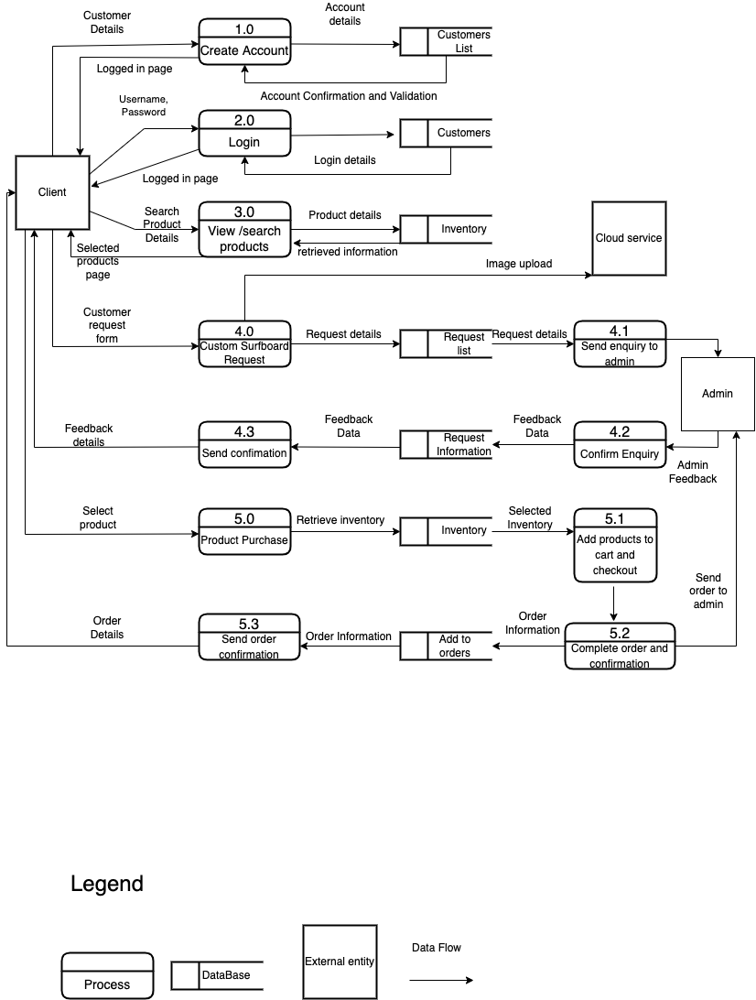

**T3A2-B Full Stack App (Part B)**

**Soot Flowcrafts**

Alaw Moradi, Sneha Bhamra, Ethan Worth and Grant Hollington

R10 A Link to your deployed website

Client: sootflowcrafts.netlify.app

Api: https://sootflowboards-api.herokuapp.com/

R11 GitHub Repository

https://github.com/Disdroido/soot_flowboards-app

R12

**T3A2 - A - Full Stack App (Part A)**

**Soot Flowcraft**

**Alaw Moradi, Sneha Bhamra, Ethan Worth and Grant Hollington**

**R1. Description **

**Purpose:**

Creating a website for a startup surfboard company, that currently does not have one, to facilitate a place to promote and sell boards. Recent trends have shown an increased demand for small business owners to have landing pages, due to over-reliance on Instagram resulting in dropped sales when the social media app globally crashed several times in past months. Our client Jacob (SOOT Flowcraft) has reached out to us to develop a beautiful website where his clients can make customisation and purchase requests.

**Functionality/features:**

- Authentication - ability to create an account/ sign in

- Cart 

- Admin view

-  Active Storage 

- Simple Mail Transfer Protocol 

- Purchase existing surfboards on the website

- Ability to request a custom surfboard with image upload functionality

  

**Target audience:**

Surfing enthusiasts in Sydney that are seeking high-end, handmade surfboards that are bespoke in form and function. 

**Tech Stack:**

- MongoDB

- ExpressJS

- ReactJS 

- NodeJS

- EmailJS

- TailwindCSS

- Firebase

- Hero Icons

**R2. Dataflow Diagram**

**R3. Application Architecture Diagram**

**R4 User Stories**

As a customer, I want to have an account,So that I can see my current and previous orders.

As a customer, I want to be informed of any errors when registering an account, So that I can accurately submit information in each required field and have all my information reflected.

As a customer, I want to be able to access and view the business’s social accounts, so that I can explore more of the business’s activity beyond the website.

As a customer, I want to view products by category, so that I can refine my search.

As a customer, I want to view images and details for each products, so that I can decide if it is the surfboard I am looking for.

As a customer, I want to add one or more surfboards to my cart from the detail, so that I can purchase my items.

As a customer, I want to receive a confirmation to my order, so that I know that the purchase has been processed.

As a surfboard enthusiast, I want to be able to request a custom made surfboard, so that I can buy a board that suits my needs.

As a customer, I want to be informed of what details to provide for my custom request, so that I can reassure that the board turns out as I would like. 

As a customer, I want to include images in my custom request, so that I can share my ideas with the shaper.

As a customer, I want to be able to communicate with the shaper via email, so that I can buy the best possible surfboard.

As a customer,  I want to write a review, so that I can share my experience with others.

As a customer, I want to read reviews, so that I can understand other customers' experiences before purchasing an item.

As an owner, I want to be able to see my net user growth, so that I can track my customers’ engagement.

As an owner, I want to see purchases of the month, so that I can track my business progress.

As an owner, I want to see a user list, so that I can be aware of my customers and give professional service.

As an owner, I want to receive custom surfboard requests in my email, so that I can communicate with my customers.

As an owner, I want to be able to save and see previous custom requests, so that I can follow up, progress and analyse my previous sales and work.

**Example of a user persona**:

 [user-persona.pdf](docs/user-persona.pdf) 

**R5 Wireframes.**

**R6 Asana Board**

